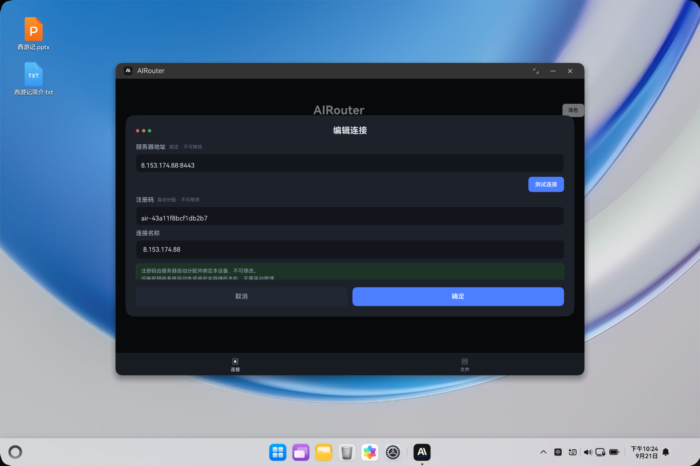
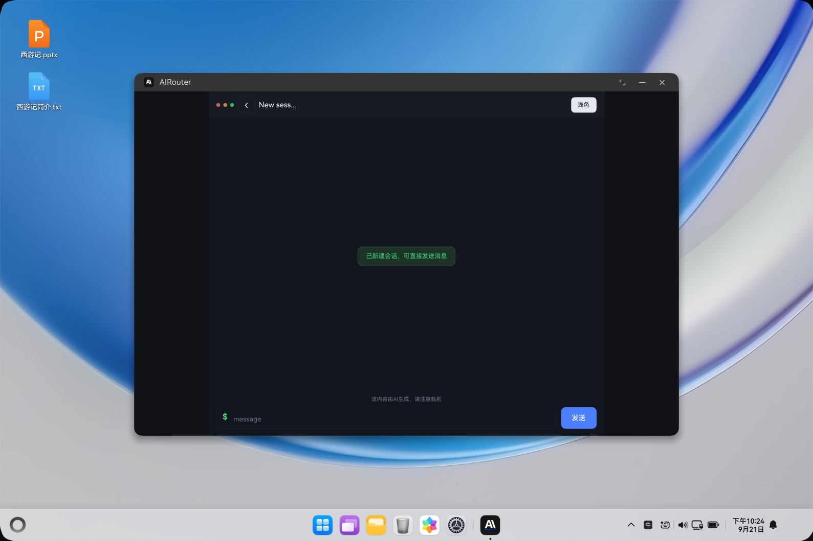
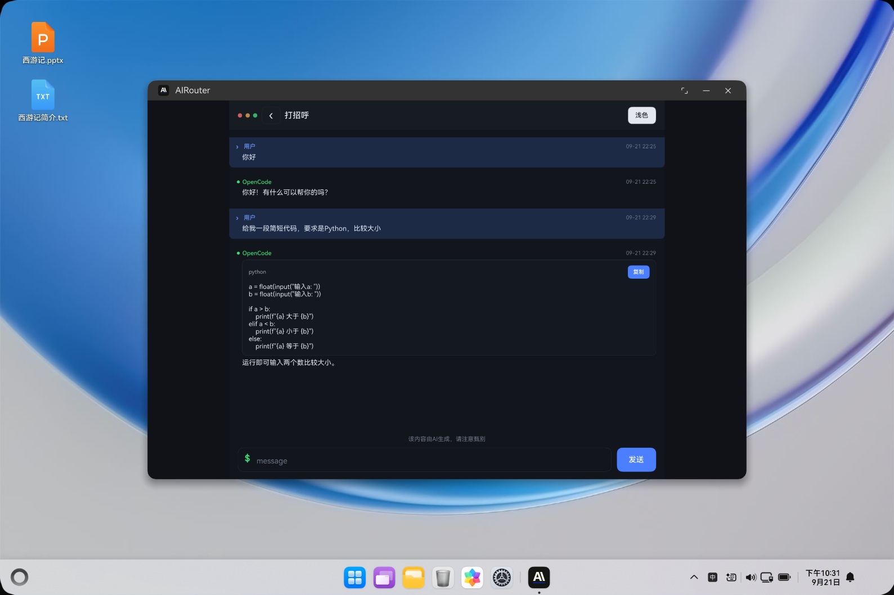
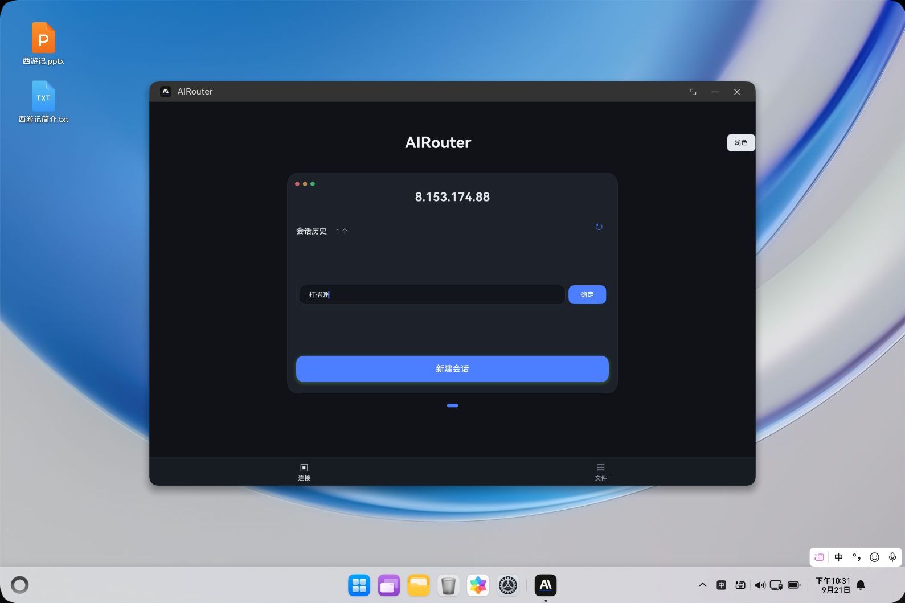
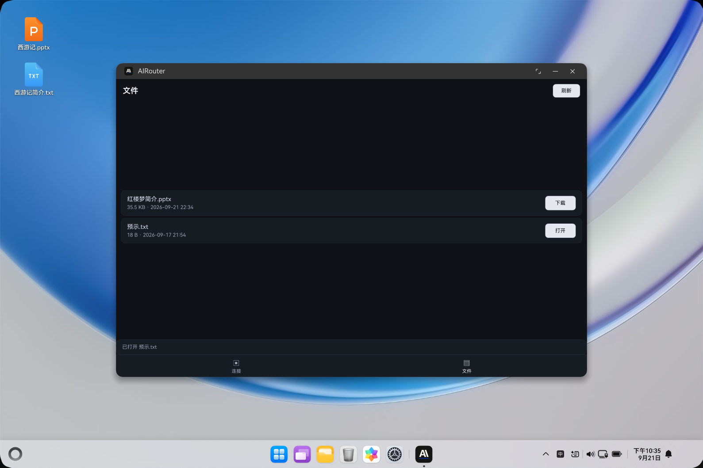
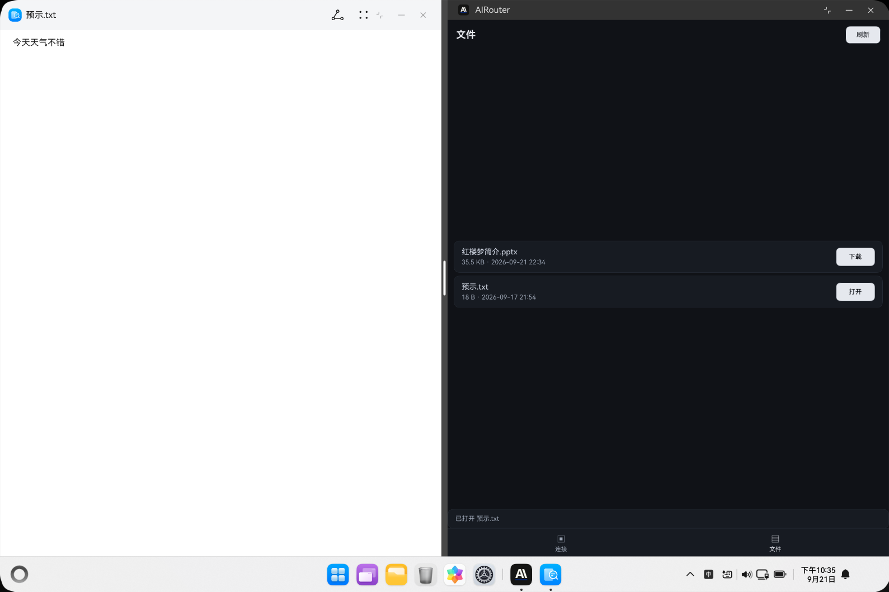
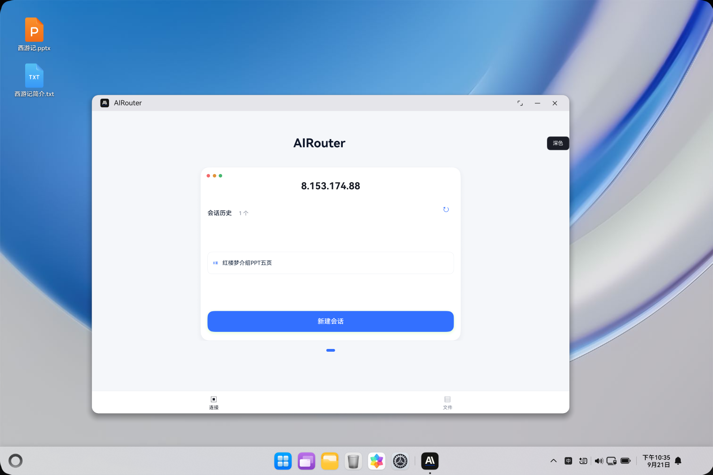
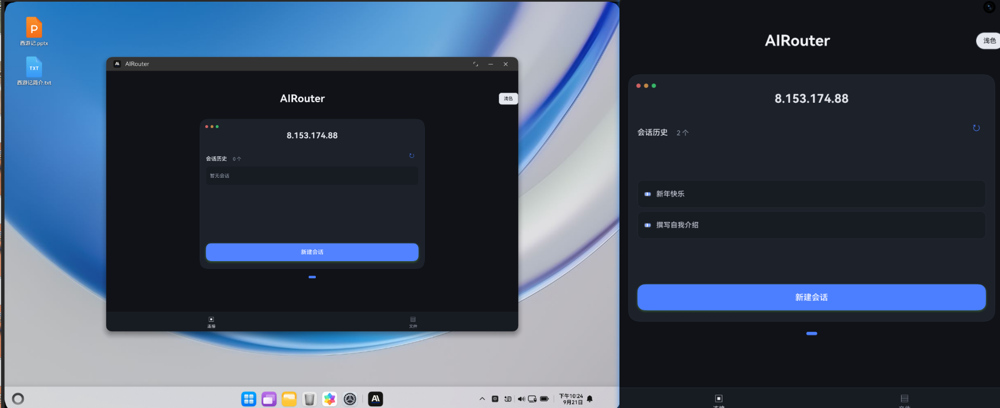

# AIRouter 连接助手软件 V1.0 使用说明书

> 软件名称：AIRouter 连接助手软件　版本号：V1.0　著作权人：陆豪

---

## 一、软件介绍

**软件类型**：本软件是一款运行于华为 HarmonyOS 设备（手机、平板、二合一）上的远程 AI 编程助手客户端应用，属于应用软件。

**开发目的**：将自托管的 AI 编码助手（OpenCode）从桌面延伸到移动端。用户离开电脑后，可随时通过鸿蒙设备连接自建的网关服务器，查看、恢复并继续服务器上的 AI 编码会话，并取回 AI 生成的文件，实现"把 AI 编码助手装进口袋、数据自主可控"。

**主要功能**：本软件固定连接一个内置的自托管网关服务器，首次启动自动完成设备注册与激活；支持会话历史列表、恢复与继续对话、消息实时收发、停止生成与复制、会话重命名与删除、设备文件区的查看与下载、深色/浅色主题切换，以及手机/平板/二合一的自适应布局。设备私钥由 HUKS 安全硬件保存，通信采用 HTTPS + 证书固定。

---

## 二、主要功能介绍

### 2.1 首次启动：自动连接与设备激活

安装并打开本软件后，软件使用内置的固定服务器地址自动发起连接，并将本机设备标识与设备公钥发送至服务器完成注册；服务器为设备自动分配注册码并绑定该设备，随后软件使用设备私钥完成签名激活，成功后进入"会话历史"页面。整个过程无需用户填写服务器地址或注册码。

若网络异常或服务不可达，页面会给出提示，用户可点击"连接"重试。

### 2.2 主界面与会话历史列表

激活成功后进入"会话历史"页面。页面顶部显示标题与"刷新"键（可重新拉取本设备会话列表）；下方按最近更新时间列出本设备的会话，每条显示会话名称与状态。点击任意会话即可进入对话；长按会话可展开操作菜单（重命名、删除）。

### 2.3 新建会话

在"会话历史"页面点击右下角的圆形"+"按钮，即可创建一条新会话并进入对话界面，可直接输入消息开始与 AI 助手交流。

### 2.4 进入历史会话并发送消息

点击会话列表中的某条历史会话，软件载入该会话的历史消息并进入对话界面。在底部输入框中输入内容，点击发送（或按回车）即可发送消息，AI 助手随后开始回复。

### 2.5 查看回复、停止生成与复制

发送后，软件持续刷新并实时显示 AI 助手的回复；回复生成过程中会显示等待/生成状态，用户可点击"停止"中断当前回复。对已生成的 AI 回复，可点击"复制"将其复制到系统剪贴板。

### 2.6 会话重命名

在会话列表中长按目标会话，弹出操作菜单，选择"重命名"，输入新的会话名称后点击"确定"，列表中的名称立即更新（无需退出重进）。

### 2.7 会话删除

在会话操作菜单中选择"删除"，确认后该会话从列表中移除并删除服务器端对应会话。

### 2.8 设备文件区：查看与下载

切换到"文件"标签可查看本设备会话产出的文件列表（仅本设备可见，跨设备隔离）。点击文件右侧的"下载"按钮即可将文件下载到本机。

### 2.9 打开已下载文件

文件下载完成后，点击对应文件即可调用系统外部应用打开查看。

### 2.10 深色 / 浅色主题切换

在页面顶部点击"深色/浅色"切换按钮，可在两种主题间切换，界面配色整体变化，且偏好会被保存，下次启动保持上次选择。

### 2.11 多设备布局适配

本软件支持手机、平板与二合一设备，并根据屏幕宽度自动调整布局：手机采用单栏布局；平板/二合一展开态采用更宽的排版区域，保证阅读与操作体验。

